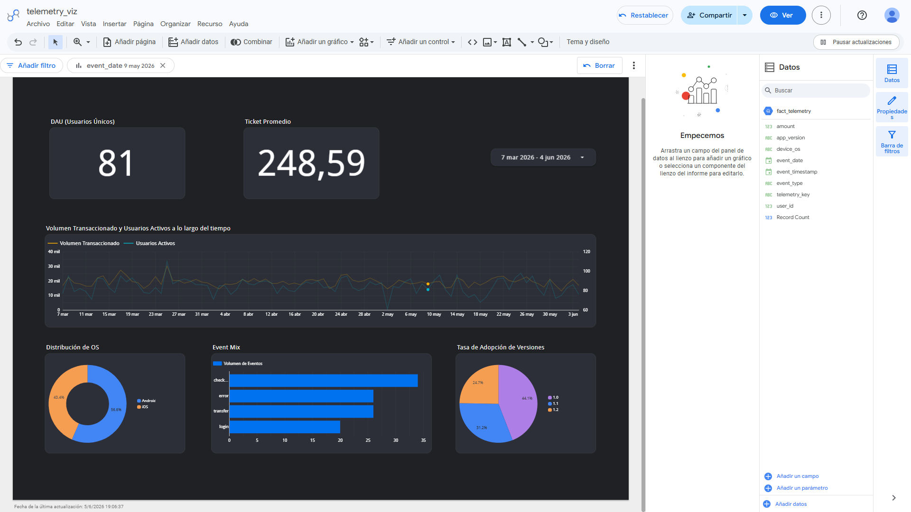
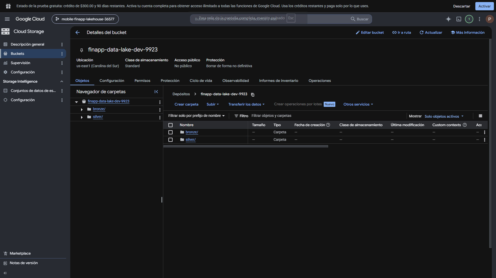
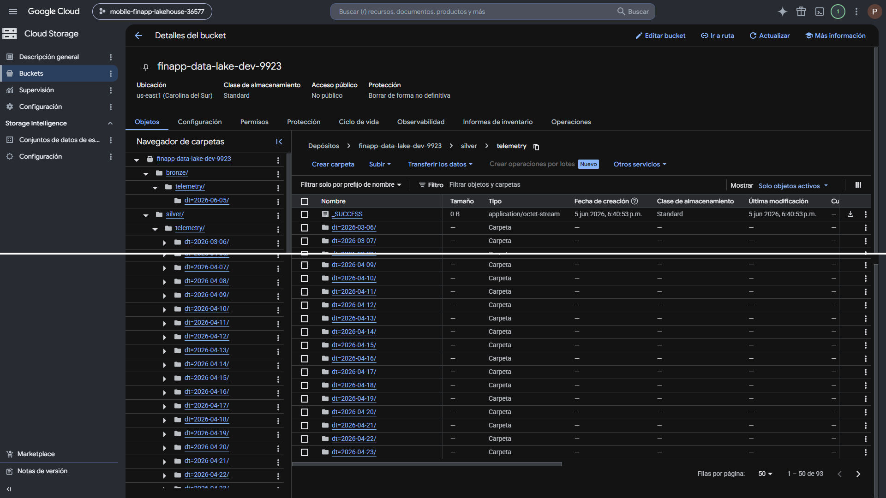
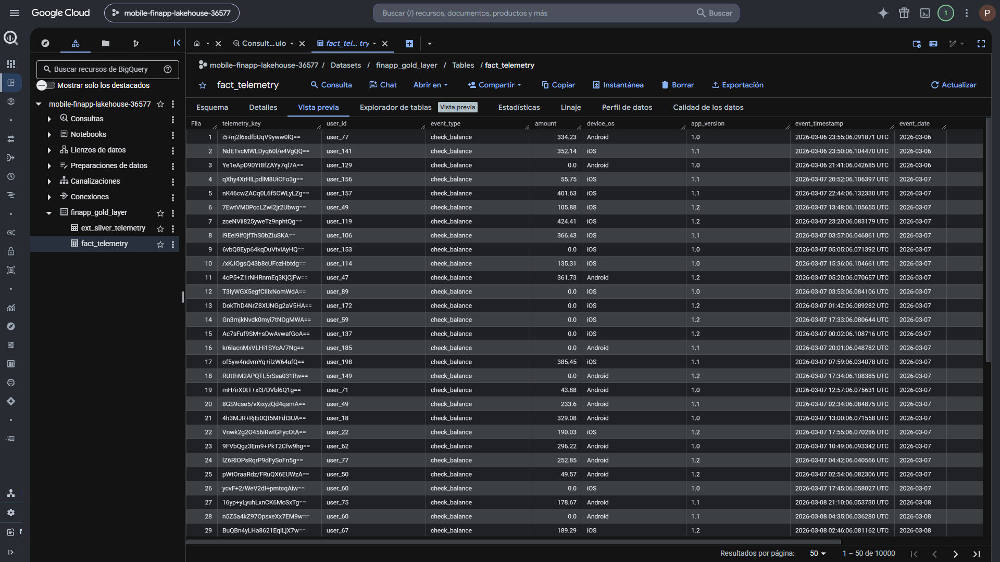

# Mobile FinApp Analytics: End-to-End Modern Data Lakehouse



Este repositorio contiene la arquitectura completa de un **Modern Data Lakehouse** a escala productiva para una aplicación móvil financiera (FinTech). El sistema implementa la arquitectura de medallón (Bronze, Silver y Gold), automatizando todo el flujo desde la generación de telemetría cruda hasta la entrega de valor analítico en dashboards interactivos.

Todo el ecosistema está contenerizado de forma local y desplegado de manera reproducible en la nube utilizando Infraestructura como Código (IaC).

---

## 1. Justificación del Proyecto

### ¿Por qué? (El Problema)
Las aplicaciones móviles modernas generan millones de eventos de telemetría por segundo (logins, transferencias, consultas, errores). Almacenar y analizar esta información en bases de datos transaccionales tradicionales degrada el rendimiento de la aplicación y resulta económicamente inviable. Se requería una infraestructura que separase el almacenamiento del cómputo, permitiendo procesar grandes volúmenes de datos analíticos sin afectar a los usuarios activos.

### ¿Para qué? (El Valor de Negocio)
Este proyecto transforma telemetría cruda y desestructurada en decisiones estratégicas. Permite al equipo ejecutivo monitorear la salud financiera del negocio, al equipo de producto entender el comportamiento del usuario para mejorar la retención, y al equipo de ingeniería detectar fallos de software (crashes) en tiempo real antes de que afecten masivamente a la comunidad de usuarios.

---

## 2. Arquitectura de Datos (Medallón)

El sistema procesa la información dividiéndola en tres capas lógicas de madurez, optimizando el almacenamiento en **Google Cloud Storage (GCS)** y el consumo en **Google BigQuery**:

1. **Capa Bronce (Raw Data):** Almacenamiento histórico e inmutable de los eventos de la app en formato orientado a filas (`.jsonl`). Conserva los datos tal y como llegaron del origen.
   
   

2. **Capa Plata (Clean & Structured):** Procesamiento batch mediante **PySpark**. El motor limpia los esquemas, tipifica los datos correctamente y los almacena en formato columnar particionado por fecha (`.parquet`), reduciendo el costo de lectura en un 90%.
   
   

3. **Capa Oro (Business & Analytics):** Modelado dimensional (Star Schema) gestionado por **dbt (Data Build Tool)**. La data se materializa físicamente como tablas analíticas optimizadas dentro de **BigQuery**, listas para ser consumidas mediante SQL por las herramientas de Business Intelligence (Looker Studio).
   
   

---

## 3. Diccionario de KPIs (Key Performance Indicators)

El modelo dimensional final expone los siguientes indicadores clave de rendimiento dentro de la tabla `finapp_gold_layer.fact_telemetry`:

| Nombre del KPI | ¿Qué mide exactamente? | Lógica de Cálculo (SQL) | Valor de Negocio |
| :--- | :--- | :--- | :--- |
| **DAU (Daily Active Users)** | Usuarios únicos que interactuaron con la app por día. | `COUNT(DISTINCT user_id)` | Mide la retención y el pulso vital de adopción de la aplicación. |
| **Volumen Total Transaccionado** | Suma total del dinero movido en la plataforma. | `SUM(amount)` | Define el tamaño y escala transaccional del negocio financiero. |
| **Ticket Promedio** | Monto medio por cada transacción válida efectuada. | `AVG(amount) WHERE amount > 0` | Perfila la capacidad de gasto y el tipo de uso del cliente financiero. |
| **Event Mix (Distribución)** | Proporción de cada tipo de acción dentro de la app. | `COUNT(telemetry_key) GROUP BY event_type` | Identifica anomalías en el comportamiento y picos inusuales de errores. |
| **Market Share de SO** | Proporción de uso entre Android e iOS. | `COUNT(telemetry_key) GROUP BY device_os` | Guía la asignación de presupuesto y prioridades del equipo de desarrollo móvil. |
| **Adopción de Versiones** | Cantidad de usuarios únicos usando cada versión activa. | `COUNT(DISTINCT user_id) GROUP BY app_version` | Monitorea la velocidad de actualización de parches críticos y seguridad. |

---

## 4. Estructura del Repositorio

```text
Mobile_FinApp_Lakehouse/
├── .env.example                 # Plantilla de variables de entorno seguras
├── .gitignore                   # Exclusión de logs, keys y entornos virtuales
├── .pre-commit-config.yaml      # Hooks de validación de código (Black, Flake8)
├── docker-compose.yaml          # Orquestación de infraestructura local
├── Makefile                     # Atajos de comandos para CI/CD
├── README.md                    # Documentación del proyecto
├── .github/
│   └── workflows/               # Pipelines de CI/CD (GitHub Actions)
├── airflow/
│   ├── dags/
│   │   └── lakehouse_pipeline.py # DAG Orquestador del flujo completo
│   ├── plugins/
│   └── requirements.txt         # Dependencias del Orquestador (proveedor de Docker)
├── dbt/
│   ├── models/
│   │   ├── fact_telemetry.sql   # Modelo dimensional (Capa Oro)
│   │   └── sources.yml          # Definición de fuentes de BigQuery
│   ├── dbt_project.yml          # Configuración del motor dbt
│   ├── profiles.yml             # Perfiles de conexión a DWH
│   └── requirements.txt         # Adaptador nativo para BigQuery
├── src/
│   ├── bronze_to_silver.py      # Transformación distribuida con PySpark
│   ├── event_generator.py       # Simulador de telemetría (Mock Data)
│   ├── Dockerfile               # Imagen del contenedor de Ingesta
│   ├── Dockerfile.spark         # Imagen del contenedor de Transformación
│   └── requirements.txt         # Dependencias de Python (Ingesta y Spark)
└── terraform/
    ├── environments/
    │   └── dev/
    │       ├── main.tf          # Declaración de GCS y BigQuery
    │       ├── providers.tf     # Proveedor de Google Cloud
    │       ├── terraform.tfvars.example # Plantilla de variables IaC
    │       └── variables.tf     # Definición de variables
    └── modules/                 # Módulos reutilizables de Terraform
```
---

## 5. Guía de Reproducción (Step-by-Step)

Si deseas clonar y ejecutar esta arquitectura en tu propia máquina y cuenta de Google Cloud, sigue estos pasos al pie de la letra.

### Prerrequisitos
* **Docker y Docker Compose** instalados.
* **Terraform** instalado.
* Una cuenta de **Google Cloud Platform (GCP)** con un proyecto creado.
* Archivo de credenciales de Cuenta de Servicio de GCP (con permisos de Admin de Storage y Admin de BigQuery).

### Paso 1: Configuración de Credenciales y Entorno
1. Clona este repositorio: `git clone https://github.com/AleHerreraSoria/Mobile_FinApp_Lakehouse.git`
2. Renombra el archivo `.env.example` a `.env` y ajusta las variables si es necesario.
3. Crea una carpeta llamada `keys/` en la raíz del proyecto y coloca ahí tu archivo JSON de credenciales de GCP. Renómbralo a `gcp-key.json`.
4. Ve a la carpeta `terraform/environments/dev/`, renombra `terraform.tfvars.example` a `terraform.tfvars` y reemplaza el valor de `project_id` con el ID de tu propio proyecto de GCP.

### Paso 2: Despliegue de Infraestructura (GCP)
Abre tu terminal en la carpeta `terraform/environments/dev/` y ejecuta:

```bash
terraform init
terraform apply -auto-approve
Esto creará tu Data Lake (GCS bucket) y tu Data Warehouse (BigQuery Dataset) en la nube automáticamente.
```

### Paso 3: Compilar las Imágenes de Docker
Ve a la carpeta src/ y construye las imágenes que usarán los contenedores:

```bash
docker build -t finapp-ingestion:1.0 -f Dockerfile .
docker build -t finapp-spark:1.0 -f Dockerfile.spark .
```

### Paso 4: Levantar el Orquestador (Airflow)
Regresa a la raíz del proyecto y enciende el clúster local de Docker Compose:

```bash
docker compose up -d
Ingresa a http://localhost:8080 (Usuario: airflow / Password: airflow).

Activa y dispara el DAG mobile_finapp_lakehouse_pipeline.
Airflow inyectará 10,000 registros históricos en la Capa Bronce y Spark los transformará a formato Parquet en la Capa Plata.
```
### Paso 5: Modelado Dimensional (dbt)
Ve a la carpeta dbt/. Abre el archivo profiles.yml y actualiza el campo project con tu ID de GCP. Luego ejecuta:

```bash
python -m venv venv
source venv/Scripts/activate  # En Windows Git Bash
pip install -r requirements.txt
dbt run
```
Esto leerá los datos en GCS y materializará la Capa Oro en BigQuery, lista para ser conectada a Looker Studio o PowerBI.

## 6. Solución de Problemas Frecuentes (Troubleshooting)
Error en Airflow: Conflict: Container name already in use
Ocurre si una tarea se interrumpió y el contenedor quedó atascado. Solución: Ejecuta docker rm -f airflow_task_ingestion o airflow_task_spark en tu terminal para liberar el nombre.

Error en dbt: BYTE_ARRAY does not match INT64
Ocurre si generaste pruebas previas y los esquemas colisionaron en la carpeta silver. Solución: Borra los archivos de las carpetas bronze y silver en tu bucket de GCP, recrea la tabla externa con terraform taint google_bigquery_table.ext_silver_telemetry y vuelve a correr Airflow.

***
